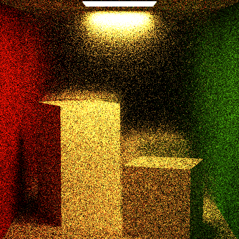
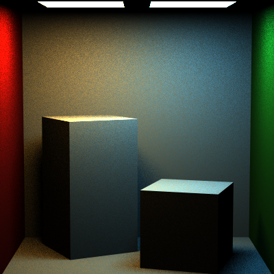
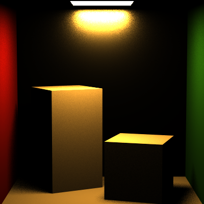
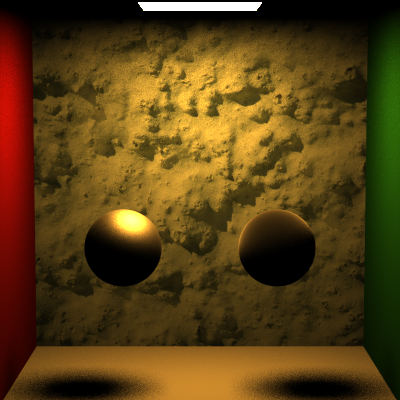
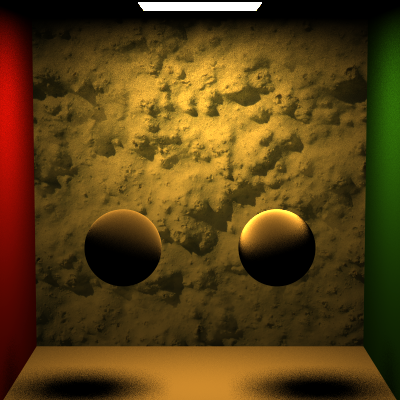

Jiarui Yan(jiaruiya) HW6 Test Result:
======================

MicrofacetBRDF Class:
-------------

MIS Example Renders:
-------------
PT_cornellBoxTwoLights.json

PT_roughMirrorBoxUniform.json

Extra Credit (In custom scene):
-------------
### 1. TrowbridgeReitz distribution roughness comparsion:
left: 0.1 roughness; right: 0.8 roughness;

### 2. Comparsion between TrowbridgeReitz and Beckmann:
left: TrowbridgeReitz, 0.5 roughness; right: Beckmann, 0.5 roughness;

